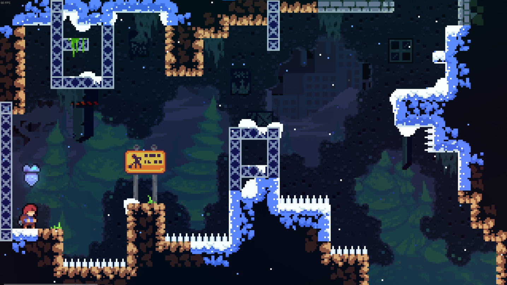
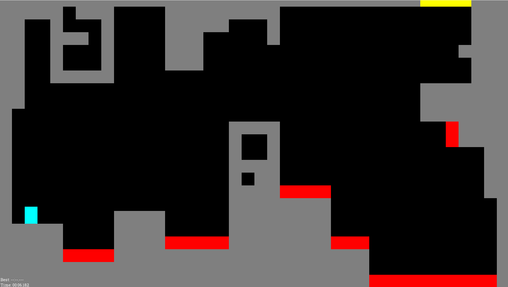

# Ascent

## Description

Ascent is a 2D platformer made in Scala with GDX2D. You go through a set of levels as fast as you can: jump, dash, dodge spikes, use orbs and springs, and reach the exit. A timer runs during the whole attempt and saves your best time when you finish every level.

The project takes inspiration from Celeste: quick controls, one dash to manage, and short rooms that are meant to be retried until you get them right.

https://github.com/user-attachments/assets/d246f72b-fcc4-4c70-a9c9-550c7a48b0f1

## Create your own levels

You do not need a level editor. Each level is a plain text file in the `levels/` folder. The game loads every `.txt` file there and plays them in numeric order, so you can add your own files to build a custom run without recompiling anything.

On the left, a room from Celeste. On the right, the same kind of idea in Ascent, drawn with characters in a text file.

<table>
  <tr>
    <td width="50%">
      
       <em>Celeste</em>
    </td>
    <td width="50%">
      
       <em>Ascent, level 1</em>
    </td>
  </tr>
</table>

One character is one tile (48×48 pixels):

| Char | Meaning        |
|------|----------------|
| `#`  | Wall           |
| `X`  | Spike          |
| `O`  | Dash orb       |
| `S`  | Spring         |
| `E`  | Exit           |
| `P`  | Player spawn   |
| `.`  | Empty          |

The first line in the file is the top row of the level. A `template.txt` file is available in the `template/` folder to get started.

## Installation

You need Java 11+ and IntelliJ (or any IDE that runs Scala).

1. Clone the repo
2. Open the project in IntelliJ
3. Keep the `levels/` folder at the project root, next to `src/`
4. Run `Main.scala` in `ch.hevs.gdx2d.game`
5. The window opens at 1920×1080 (fixed size, no fullscreen)

## Controls

| Key          | Action                               |
|--------------|--------------------------------------|
| `←` / `→`    | Move                                 |
| `Space`      | Jump (on ground)                     |
| `Left Shift` | Dash (direction with arrow keys)     |
| `R`          | Restart the run from level 1         |

If you dash without pressing an arrow key, it goes left or right depending on where you were already moving.

## Game rules

Touch the exit tile to go to the next level. Spikes send you back to your spawn point on the same level. Orbs give your dash back; they disappear for a moment and then return. Springs bounce you upward.

You get one dash until you land on the ground again or pick up an orb. Time and best time are shown in a corner. When you clear the last level, your time is compared to your previous best and the run continues from level 1.

---

School project - Module 101.2 <em>Prog. orientée-objets</em>, HES-SO Valais. 
Kevin Ferreira, 2026. Built with GDX2D (HEVS).
